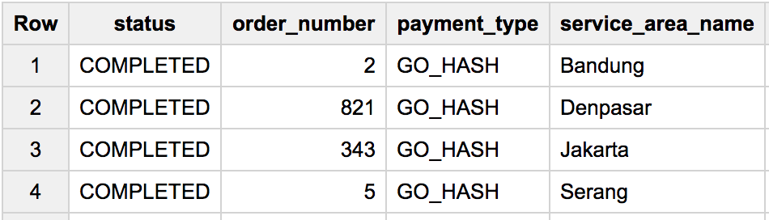

# beam_streaming
Stream processing using google cloud platform

Tools used:
  * Google cloud pubsub
  * Apache Beam
  * BigQuery
  
# WorkFlow :
Publishing incoming orders through the pubsub queue and using apache beam process the incoming stream at realtime,calculate total order count per service name and payment type. Once processed the data streamed directly to bigquery table.

# How to run:

To start the publisher, run `python pubsub.py --tast='publish' --input_topic="" --subscription_topic="" --number_of_records=""`

To start the stream process, run `python beam_streaming.py --input_topic=""`

# Output:

# Data Flow:

